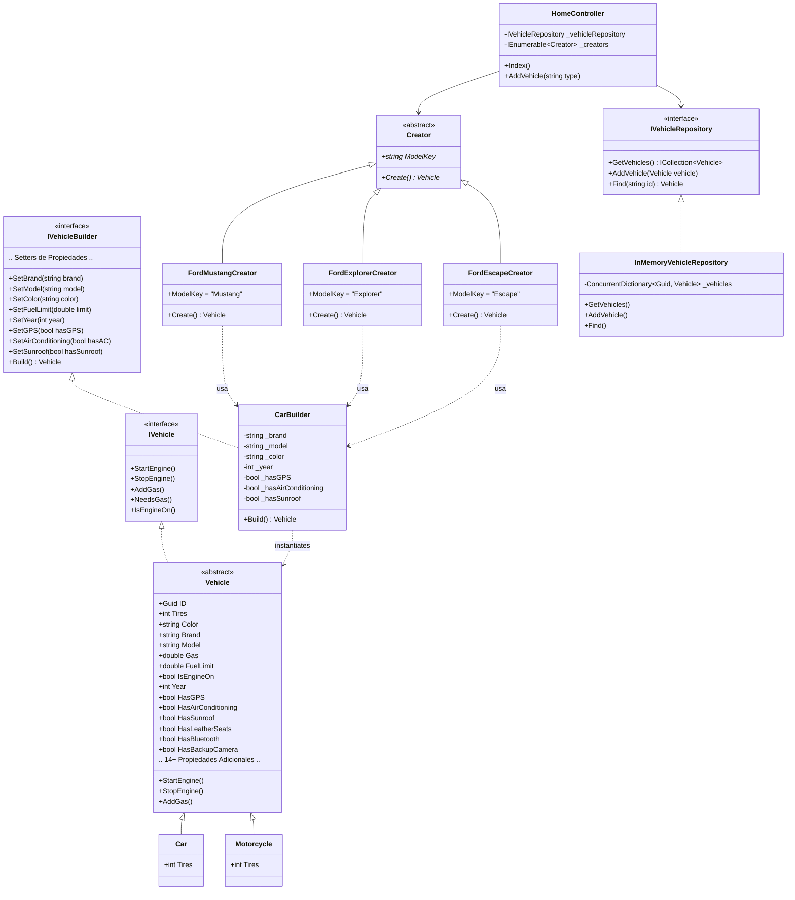

# Documento Técnico: Aplicación de Mejores Prácticas, Principios SOLID y Patrones de Diseño

**Curso:** Arquitectura de Software  
**Autor:** Santty111  
**Repositorio Personal:** [https://github.com/Santty111/taller12.git](https://github.com/Santty111/taller12.git)

---

## 1. Identificación del Problema dentro de las Restricciones del Proyecto

El código base original del proyecto presentaba múltiples vulnerabilidades arquitectónicas y violaciones a los principios de diseño de software orientado a objetos (**SOLID**), las cuales limitaban la mantenibilidad, escalabilidad y la capacidad de realizar pruebas aisladas.

### 1.1. Restricciones y Limitaciones del Proyecto
1.  **Base de datos no lista**: El equipo de base de datos no ha finalizado el esquema. Sin embargo, el sistema requiere probarse operativamente de inmediato. El repositorio anterior (`DBVehicleRepository`) arrojaba `NotImplementedException`, bloqueando el funcionamiento.
2.  **Crecimiento desmedido de propiedades (Escalabilidad de Vehículo)**: El negocio requiere agregar el año de fabricación actual y planea introducir más de 20 nuevas propiedades por defecto en el siguiente sprint. El acoplamiento a constructores posicionales obligaría a alterar todos los submodelos (`Car`, `Motorcycle`), provocando cambios disruptivos en el código cliente.
3.  **Adición frecuente de nuevos modelos**: La unidad de negocio prevé la incorporación constante de nuevos tipos de vehículos. En el escenario actual, agregar un modelo (como el **Ford Escape**) requería modificar el controlador y la interfaz gráfica directamente, violando el principio de abierto/cerrado.

### 1.2. Análisis Técnico de Violaciones a Principios SOLID
*   **Principio de Responsabilidad Única (SRP)**:
    *   `HomeController` se encargaba tanto de recibir peticiones HTTP como de instanciar creadores concretos (`new FordMustangCreator()`). Esto entrelaza la capa de presentación con la lógica de instanciación de objetos.
    *   La clase `Vehicle` contenía lógica de comportamiento de negocio (`StartEngine()`, `AddGas()`) junto a campos de datos extensos.
*   **Principio de Abierto/Cerrado (OCP)**:
    *   Agregar un vehículo requería un endpoint único (`AddMustang`, `AddExplorer`) en `HomeController`. Añadir un tercer modelo implicaba reescribir código en el controlador y la vista.
*   **Principio de Inversión de Dependencias (DIP)**:
    *   El controlador dependía directamente de creadores concretos en lugar de depender de abstracciones.
    *   El repositorio `MyVehiclesRepository` dependía de un singleton global estático (`VehicleCollection.Instance`), impidiendo la inyección y testing controlado.
*   **Falla de Repositorio Reportada por QA**:
    *   QA reportó fallas funcionales debido a que el controlador realizaba lecturas puenteando el repositorio (accediendo a `VehicleCollection.Instance.Vehicles` directamente) mientras que las escrituras se hacían en el repositorio. Además, el repositorio estaba registrado como `Transient`, lo que creaba una nueva instancia en cada petición perdiendo la coherencia de datos.

---

## 2. Metodologías Integrales de Solución (Patrones de Diseño)

Para solventar estos problemas y cumplir con las restricciones del proyecto, se seleccionaron tres patrones de diseño del catálogo GoF (*Gang of Four*) y patrones arquitectónicos complementarios:

### 2.1. Patrón Repository (con Inyección de Dependencias)
*   **Justificación Técnica**: Se mantiene la interfaz abstracta `IVehicleRepository` y se crea una implementación en memoria temporal de alta fidelidad: `InMemoryVehicleRepository`. Esta clase utiliza un `ConcurrentDictionary` interno para garantizar operaciones atómicas seguras en entornos web concurrentes.
*   **Solución al problema**: Permite simular y probar todas las operaciones CRUD y de negocio del controlador sin requerir la base de datos real. Al estar registrado en el contenedor de servicios IoC de ASP.NET Core como **Singleton** en [ServicesConfiguration.cs](file:///c:/Users/ASUS%20TUF%20F15/Desktop/Uni/WEB%20TRABAJOS/taller%2012/BestPractices/Infraestructure/DependencyInjection/ServicesConfiguration.cs), los datos persisten entre peticiones HTTP y resuelven el error de coherencia reportado por QA. Cuando la base de datos esté lista, solo se registrará la nueva clase de Entity Framework, sin tocar una sola línea de código del controlador.

### 2.2. Patrón Factory Method
*   **Justificación Técnica**: Se define una clase abstracta `Creator` con una propiedad identificadora `ModelKey` y un método abstracto `Create()`. Cada vehículo cuenta con su respectiva fábrica concreta (`FordMustangCreator`, `FordExplorerCreator`, `FordEscapeCreator`).
*   **Solución al problema**: Permite que `HomeController` inyecte dinámicamente un conjunto de creadores (`IEnumerable<Creator>`). El método de acción `AddVehicle(string type)` busca en la colección la fábrica que coincida con el tipo recibido y delega la creación. Al agregar nuevos modelos en el futuro, solo se crea su clase `Creator` y se registra en la DI, eliminando la necesidad de modificar el controlador o las vistas existentes (**Cumple OCP y DIP**).

### 2.3. Patrón Builder
*   **Justificación Técnica**: Se implementa `IVehicleBuilder` y su concreción `CarBuilder` para configurar de manera fluida (fluent API) los vehículos.
*   **Solución al problema**: Centraliza los valores por defecto de las más de 20 propiedades solicitadas por el negocio. Al construir el vehículo, el builder aplica estos valores por defecto y permite anidar opcionalmente configuraciones personalizadas (ej: `.SetGPS(true).SetColor("Red")`). Esto encapsula la inicialización compleja y previene el anti-patrón de constructor telescópico, minimizando el impacto de cambios en el siguiente sprint (si se añaden nuevas propiedades, solo se actualiza el builder y no los constructores de los submodelos).

---

## 3. Diseño Estructural (Diagrama UML)

A continuación se detalla la estructura propuesta mediante un diagrama de clases UML representable en Mermaid:



---

## 4. Propuesta Técnica y Prototipo

El prototipo funcional se encuentra completamente implementado en C# y subido al repositorio Git personal:
*   **Enlace de acceso**: [https://github.com/Santty111/taller12.git](https://github.com/Santty111/taller12.git)

### Estructura de archivos clave en el repositorio:
1.  **Modelo y Atributos**: [Vehicle.cs](file:///c:/Users/ASUS%20TUF%20F15/Desktop/Uni/WEB%20TRABAJOS/taller%2012/BestPractices/Models/Vehicle.cs) (Contiene la lógica de negocio y las 20+ propiedades con el año de fabricación).
2.  **Patrón Builder**: [IVehicleBuilder.cs](file:///c:/Users/ASUS%20TUF%20F15/Desktop/Uni/WEB%20TRABAJOS/taller%2012/BestPractices/ModelBuilders/IVehicleBuilder.cs) y [CarBuilder.cs](file:///c:/Users/ASUS%20TUF%20F15/Desktop/Uni/WEB%20TRABAJOS/taller%2012/BestPractices/ModelBuilders/CarBuilder.cs) (Encapsulan el ensamble con propiedades opcionales fluidas).
3.  **Patrón Factory Method**: Ubicado bajo la carpeta [Factories](file:///c:/Users/ASUS%20TUF%20F15/Desktop/Uni/WEB%20TRABAJOS/taller%2012/BestPractices/Infraestructure/Factories), con el nuevo modelo [FordEscapeCreator.cs](file:///c:/Users/ASUS%20TUF%20F15/Desktop/Uni/WEB%20TRABAJOS/taller%2012/BestPractices/Infraestructure/Factories/FordEscapeCreator.cs).
4.  **Patrón Repository**: [InMemoryVehicleRepository.cs](file:///c:/Users/ASUS%20TUF%20F15/Desktop/Uni/WEB%20TRABAJOS/taller%2012/BestPractices/Repositories/InMemoryVehicleRepository.cs) (Resuelve el desacoplamiento de la base de datos).
5.  **Inyección de Dependencias**: [ServicesConfiguration.cs](file:///c:/Users/ASUS%20TUF%20F15/Desktop/Uni/WEB%20TRABAJOS/taller%2012/BestPractices/Infraestructure/DependencyInjection/ServicesConfiguration.cs) (Configura el ciclo de vida del repositorio como singleton y registra las fábricas).
6.  **Controlador Desacoplado**: [HomeController.cs](file:///c:/Users/ASUS%20TUF%20F15/Desktop/Uni/WEB%20TRABAJOS/taller%2012/BestPractices/Controllers/HomeController.cs) (Utiliza llamadas genéricas basadas en abstracciones inyectadas).

---

## 5. Validación del Prototipo y Evidencia Local

### 5.1. Ejecución de Pruebas Unitarias
Se ha configurado una suite automatizada con 12 pruebas unitarias de cobertura total (dominio, fábricas, constructor y persistencia en memoria). 
Para ejecutar las pruebas localmente:
```bash
dotnet test "Best Practices.sln"
```

*Resultado de la ejecución local:*
```text
Serie de pruebas para C:\Users\ASUS TUF F15\Desktop\Uni\WEB TRABAJOS\taller 12\BestPractices.Tests\bin\Debug\net9.0\BestPractices.Tests.dll (.NETCoreApp,Version=v9.0)
Correctas! - Con error: 0, Superado: 12, Omitido: 0, Total: 12, Duración: 25 ms
```

### 5.2. Evidencia de Ejecución de la Interfaz Web (Local)
Los archivos de evidencia multimedia se encuentran en la carpeta raíz del proyecto, dentro del directorio `/evidencias`:

1.  **Captura del Prototipo Verificado**: [captura_ejecucion.png](file:///c:/Users/ASUS%20TUF%20F15/Desktop/Uni/WEB%20TRABAJOS/taller%2012/evidencias/captura_ejecucion.png) (Muestra la tabla del Home Page con Mustang, Explorer y el nuevo modelo Escape, incluyendo la columna "Año" e interacciones).
2.  **Video de Evidencia de Funcionamiento**: [video_evidencia.webp](file:///c:/Users/ASUS%20TUF%20F15/Desktop/Uni/WEB%20TRABAJOS/taller%2012/evidencias/video_evidencia.webp) (Muestra en tiempo real la navegación por la aplicación, la creación exitosa de vehículos de forma dinámica, la validación de gasolina al encender y el repostado).

---
*Fin del documento técnico.*
